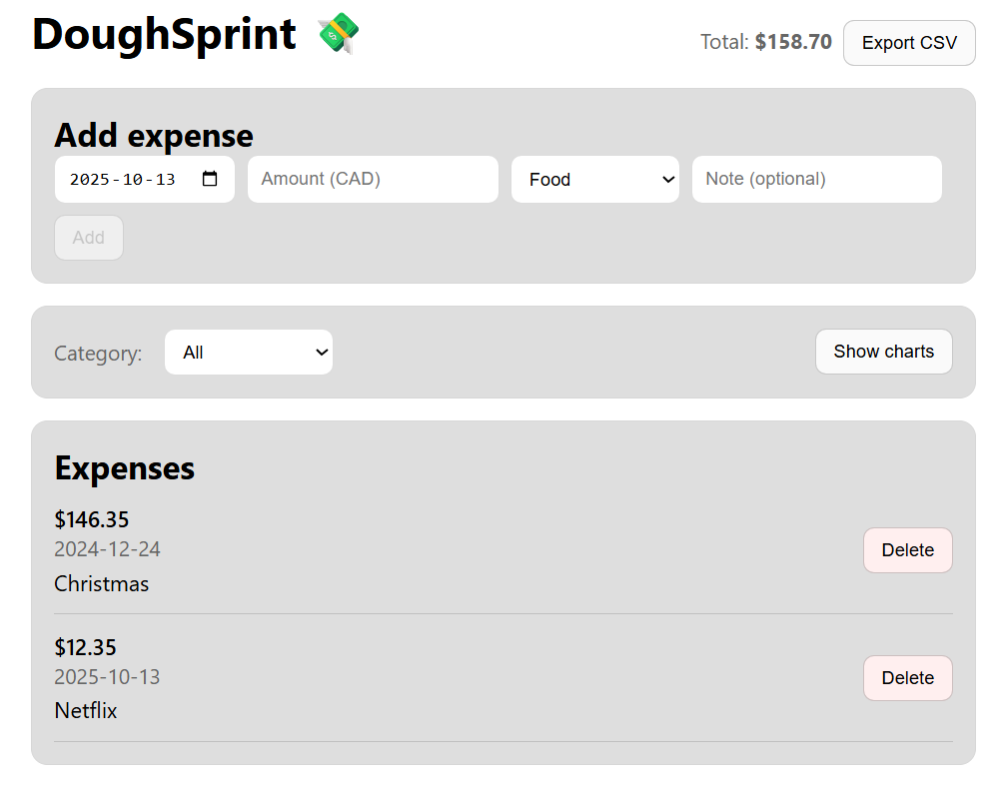
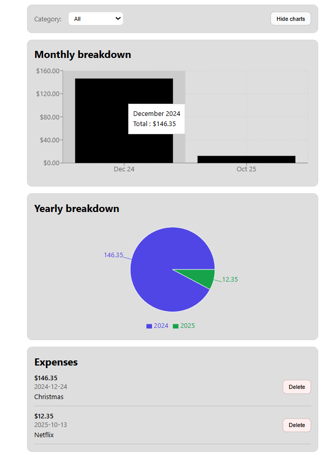

# DoughSprint 💸

Track your expenses, to manage your dough (money), and sprint to savings — a small expense tracker.




## 📚 Overview

**DoughSprint** is a lightweight expense tracker built with **React.js**.  
It focuses on the essentials: adding expenses, filtering by category, visualizing spending, and exporting your data.

---

## ✨ Features

- **Add / Delete Expenses** – Simple form to capture date, amount, category, and a note.
- **Monthly & Yearly Breakdown** – Clean charts powered by **Recharts** for visualizing your spending over time.
- **Filter by Category** – Focus on what matters.
- **Export to CSV** – One click to download your current view.
- **Local Persistence** – Saves to `localStorage` so your data survives browsing sessions.

---

## 🛠️ Tech Stack

- **Frontend:** React.js
- **Charts:** Recharts
- **Styling:** CSS
- **Data Storage:** localStorage
- **Linting & Formatting:** ESLint, Prettier
- **Package Manager:** npm

---

## 🚀 Getting Started

1. **Clone the repository:**

    ```bash
    git clone https://github.com/Wilfried-O/doughsprint.git
    ```

2. **Navigate to the project directory:**

    ```bash
    cd doughsprint
    ```

3. **Install dependencies:**

    ```bash
    npm install
    ```

4. **Start the development server:**

    ```bash
    npm start
    ```

5. **Open in your browser:**  
   http://localhost:3000

---

## 📋 Project Status

- ✅ **Feature complete:**
    - Add expense, list expenses, and delete expenses
    - Category filter
    - CSV export
    - Monthly/Yearly charts (Recharts)

- ⚙️ **Work in Progress:**
    - Refactoring and cleanup (add CSS Modules for components)
    - Improve styling to make the look more polished

### 🧭 Next Steps

- Add dark mode
- Support US currency ($USD)
- Support French language
- Add logo and icons

---

## 🤖 AI Assistance

This project uses AI assistance for planning, coding, and debugging.  
All code is reviewed and fully understood by the author to ensure quality, clarity, and safety.

---

## 📄 License

This project is licensed under the **MIT License**.
